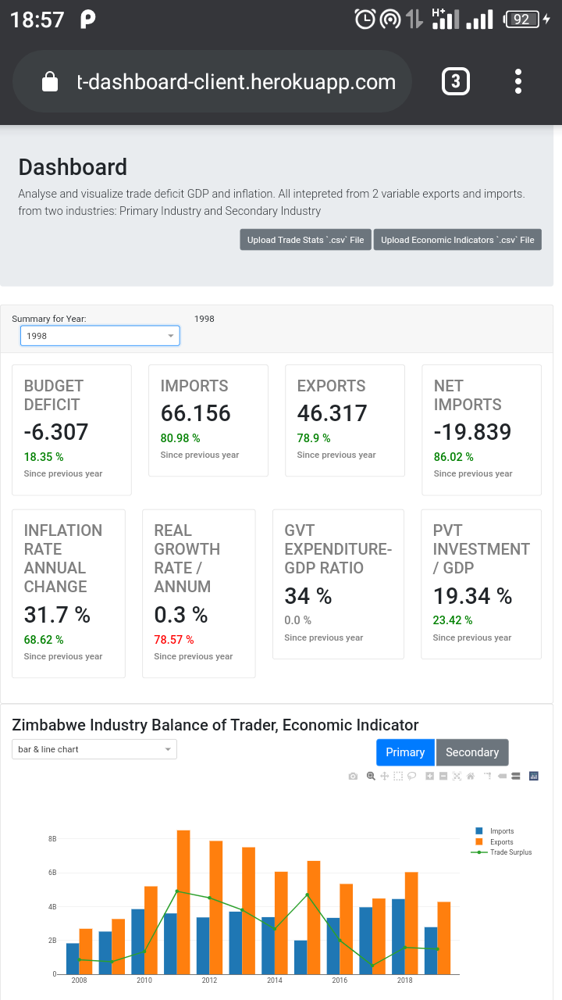
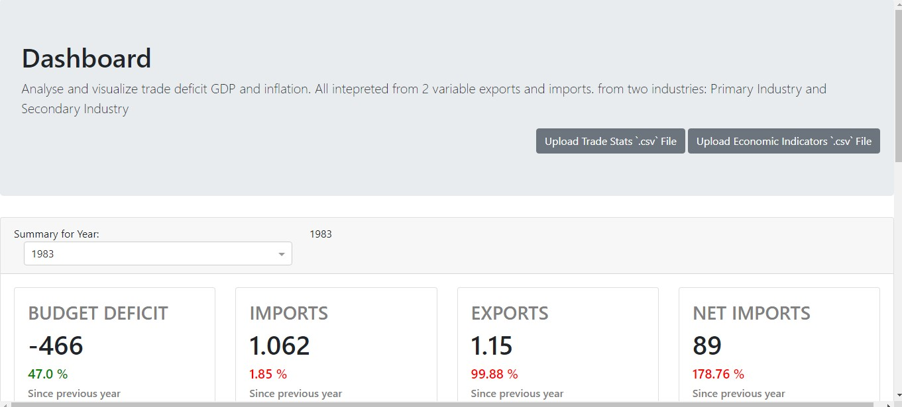

# DashDashboard
visualize GDP data over a certain period from uploaded file

## Deploy
[](https://heroku.com/deploy)

## Setup
create a virtualenvironment and install dependencies
```bash
$ pip install -r requirements.txt
```

## Tools
Made with [Python Dash library](https://dash.plotly.com/introduction) 

## Demo
Mobile view (`hosted on heroku`)
<table>
   <tr>
      <td> home1</td>
      <td> home2</td>
      <td> auth</td>
      <td> graph</td>
   </tr>
   <tr>
      <td></td>
      <td></td>
      <td></td>
      <td></td>
   </tr>
</table>

</br>
</br>
Web View
<table>
   <tr>
      <td> home1</td>
      <td> home2</td>
      <td> graph</td>
   </tr>
   <tr>
      <td></td>
      <td></td>
      <td></td>
   </tr>
</table>

## Data
data provided does not conform to Zimbabwe actual economic data!